# [TOURISTS GUIDE](https://frankkode.github.io/tourist-guide/#)

## Overview

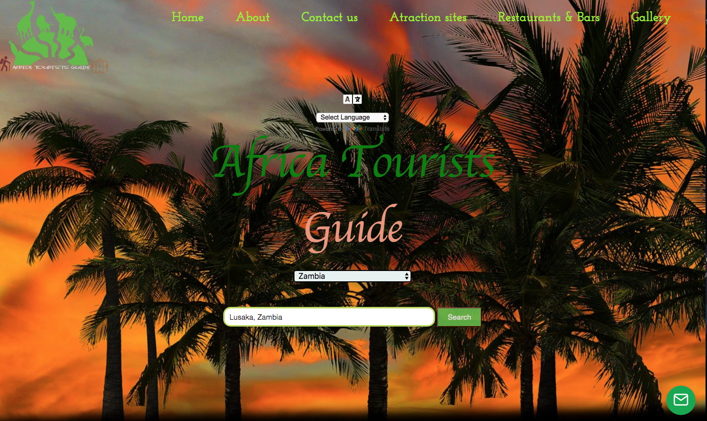

- Turists Guide is designed for those looking to explore the world. With this application they can be able to access almost all primary services needed as a tourist, tourists guide map works on all devices, you can search for hotels, bars, restaurants and more anywhere around the globe. This information contains contact details and star ratings to make your dinning, accommodation or travel decisions a smooth and user-friendly experience.

## The Goal & Purpose of the website

Tourists guide is designed for those who want to visit africa.
it allows users to choose language,choose a Country by selector and city input, the search takes you to your destination where you can choose your main search, like airports, Attractions sites, Accommodation,Banks , Restaurants, Bars.
from the map you can get information regarding your search result such as rating,phone number, website and so on

## Purpose

The purpose of this website is to help tourists in different way while they are visiting african countries.
the owner can profit from tourists who want to book for transport cars

## UX

- As a user, i am looking to travel to a new city, I want to find Restaurants and Bars within the area of interest I can search hotels by choosing the country and the city.
  I can search for museums, restaurants, bars, airports and banks.

- As a user, I would like to travel I can use one of the atraction sites links to get hints of great touristic destinations. Then use this website to find more information.

- If i don't find exactly the information i can send an email and get more imformation from tourists guide staffs.

- I can choose high rating hotel through the dashboad
- Using the Restaurants selector I can choose high rating restaurant through the dashboad.
- As a user if i want to advertise on the website i can contact them.

## Mockup

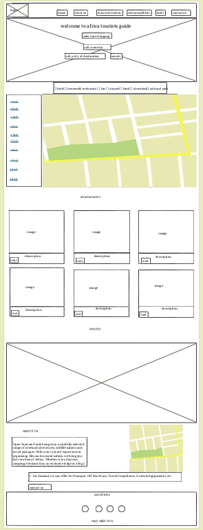

- Calling

- Services

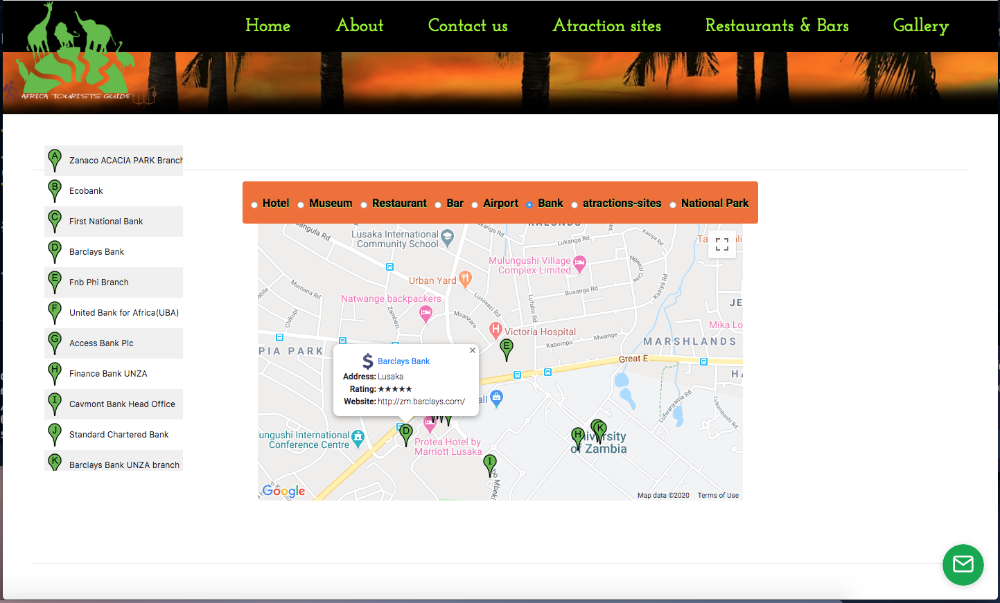

## Features

- Tourists guide uses Google Maps api to display result.

- The atraction sites links show to users atractions sites around africa.
- The email makes direct contact to manager about reports, advertising , business partnerships or general questions.

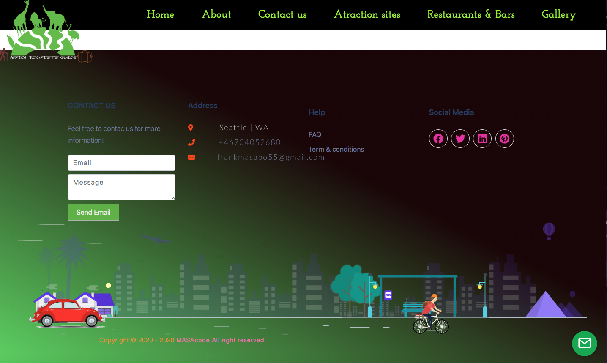

- About us

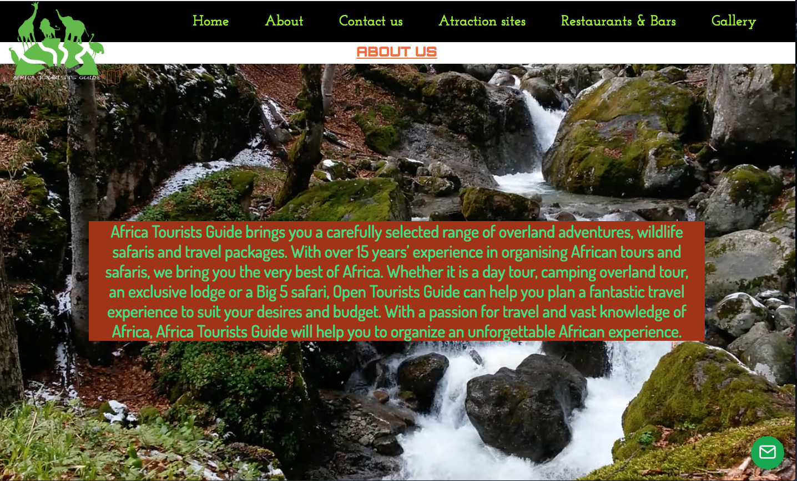

## Features left to implement

- Payment for advertisements
- connect direct to the owners of bars,restaurants so i can get commission when the customer paid through the the web.

## Technologies

- This project is build using HTML, CSS, JavaScript,bootstrap,jquery

## Techonologies & Languages Used

- [HTML5](https://developer.mozilla.org/en-US/docs/Web/Guide/HTML/HTML5)

- [CSS3](https://developer.mozilla.org/en-US/docs/Archive/CSS3)

- [JavaScript](https://developer.mozilla.org/en-US/docs/Web/JavaScript) Stripe JavaScript was used to render the payment processing.

- [vscode](https://www.visionstudio.com/) Visionstudio was the code editor used to code the whole project with.

- [jQuery](https://jquery.com/) The project uses JQuery to simplify DOM manipulation.

- [Github](https://github.com/) Github was used to document the project progress.

- [HTML Validator](https://validator.w3.org/) This was used to validate the HTML code.

- [HTML Formatter](https://htmlformatter.com/) This was used for formatting the HTMl code.

- [Bootstrap](https://getbootstrap.com/docs/4.4/getting-started/introduction/) bootstrap was used for the box image class, footer and and navbar

- [Font Awesome](https://fontawesome.com/) Font Awesome was used to style the fonts/icons of the page.
- [Google map](https://developers.google.com/maps/documentation/) Font Awesome was used to style the fonts/icons of the page.

- [Mailjs](www.emailjs.com/) Font Awesome was used to style the fonts/icons of the page.

- [Chrome Devtools](https://developers.google.com/web/tools/chrome-devtools) Google Chrome Devtools was used for inspecting webpage for any errors and used for designing the page in a faster way.

## Testing

- The code was tested on Google Chrome Developer Tools

HTML code has been tested with mark-up validation service

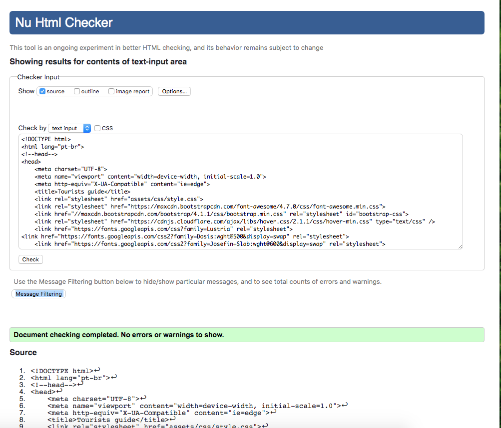

- CSS code has been tested with CSS validation service

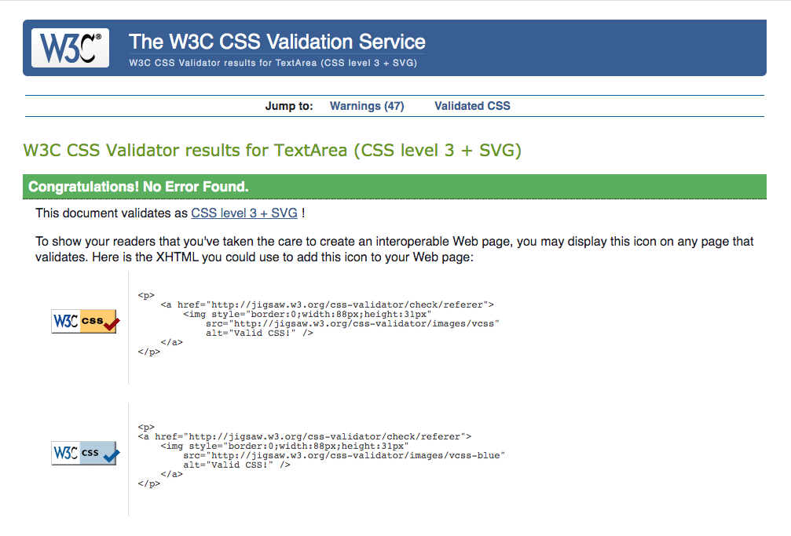

- Javascript and jQuery code has been tested using JSLint

- Email function was tested using Gmail and Emailjs
- The code has been tested on Google Chrome
  The code has been tested on Mozilla Firefox
- The code has been tested on safari

## Bugs fixed

- City search bar not emptying after country dropdown changed. fixed by switch the country dropdown and search bar positions.
- email accepting any input fixed by using pattern=".+@" making it only accept input with @ in it

- Tested to ensure the Googles Maps API and Google Places API have been connected to the deployed GitHub Pages. Setting both API to enabled on Google map javascript api website.

- markers on map not clearing after changing search area. Fixed with clearMarkers onclick function

- Markers not showing on side panel on desktop, google chrome extensions (adblocker) disabling image or marker. (adblocker needs to be allowed on the page to work)

## Browser testing for all features:

- Testing screen sizing iPAD pro.

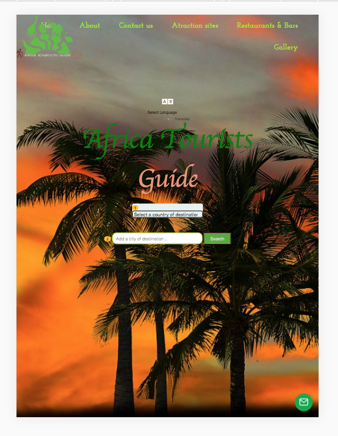

- Testing screen sizing iPAD.

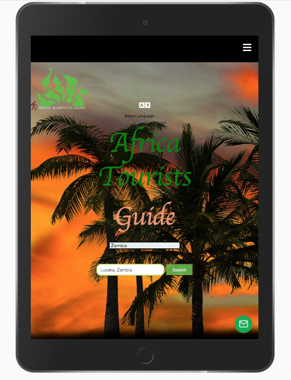

- Testing screen sizing iphone.

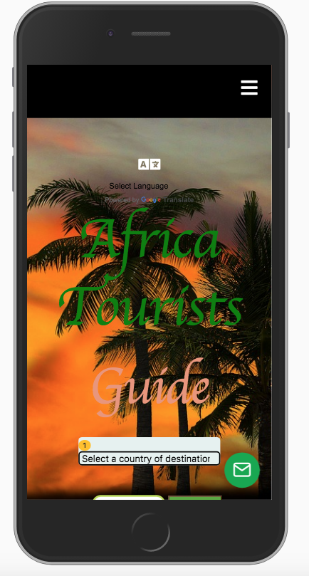

- Testing screen sizing samsung.

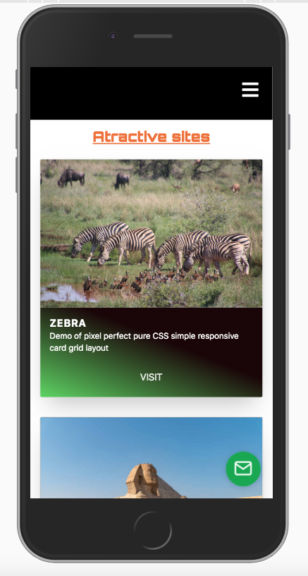

- Map in standard view and full screen.

- Selector radio buttons.

- Email test sent.

- atraction sites links.

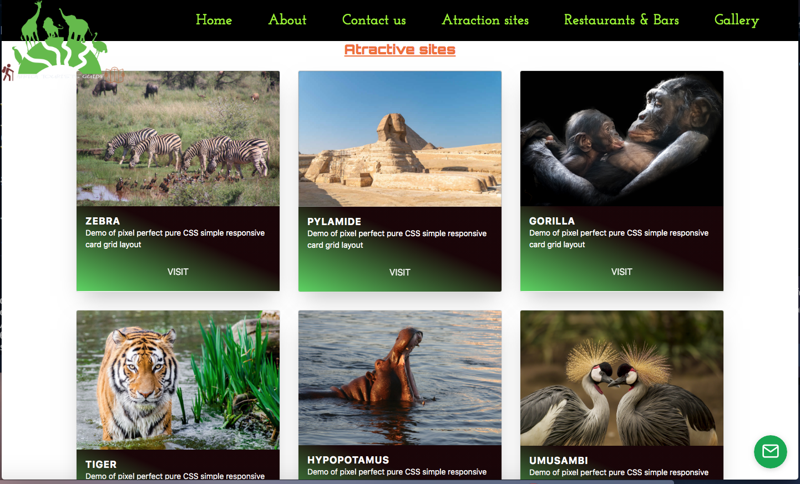

## All functionalities were tested in the following browsers:

- Google Chrome
- Mozilla Firefox
- Opera
- Microsoft Edge

## Deployment

- This site is hosted using GitHub , deployed directly from the master branch. The deployed site will update automatically upon new commits to the master branch.

## The process to deploying on GitHub page is the follow:

- From "https://github.com/frankkode/tourist-guide" , master branch.
  Make sure the source is the master branch.
  GitHub will generate the URL which is always available in the settings of the Repository
  To run locally, you can clone this repository directly into your editor by pasting git clone "https://github.com/frankkode/tourist-guide" into your terminal. To do so, type git remote rm origin into the terminal.

- To run the deployed website simply click the link below.
  [Tourist-guide](https://frankkode.github.io/tourist-guide/)

## How to Clone

[Using this link Github](href="https://github.com/frankkode/tourist-guide/")

- On GitHub, navigate to the main page of the repository
- Click Clone Or Download.
- On the Clone with HTTPS pop up, copy the clone URL for the repository.
- Change the current working directory to the location where you want the cloned directory to be made.
- In a linux enviroment like vscode IDE type git clone then paste the URl from the clone with HTTPS

## Making changes

- From the clone as a developer you can make changes to the repository

- Once your changes have been made and tested, you can set up your GitHub pages to Deploy automatically whatever you change.
- In GitHub navigate to your github repository and click Settings.
  Within Settings, navigate to the Source section within the GitHub Pages section. From the dropdown menu, selet master branch and then click Save.
- Your GitHub pages site is set up, you can use git commit and git push to send yours changes to GitHub.

## Media

- The logo used in this website were obtained from free [logo maker](href="https://www.logofury.com/")

- The background image and all photos was obtained from free stock photos website [pixel](href="https://www.pexels.com/search/animal%20park/")
- Maps obtained from googles map api

## Credits

- JavaScript Code snippets used for Maps, markers and clearing the markers from Google
- Gallery from bootstrap

- The progress of sending email and some other technical skills used in modal was taken from

[Stack Overflow](href="https://stackoverflow.com/questions/14589193/clearing-my-form-inputs-after-submission")

## Disclaimer

The content used in this website is for educational purposes only.
